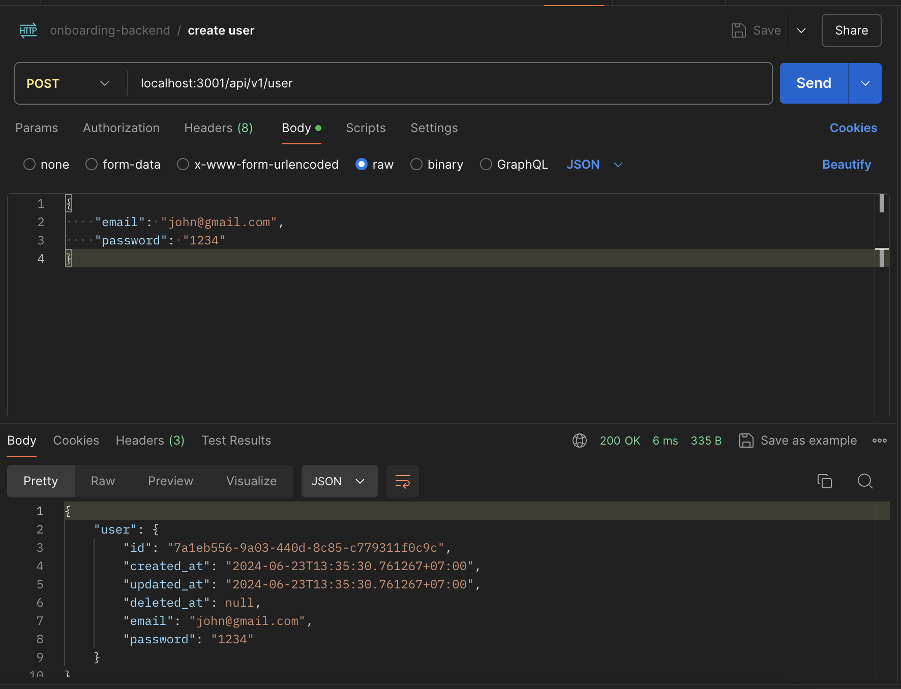
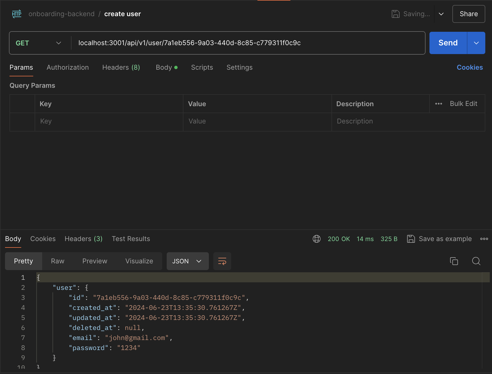
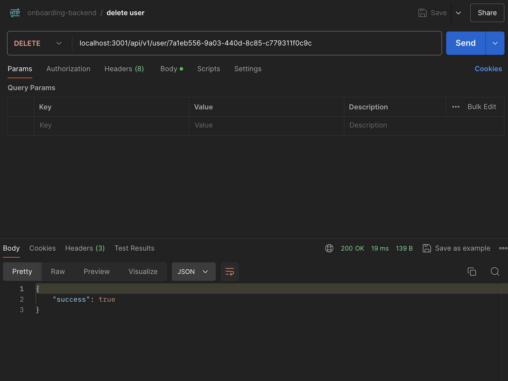

# 6-router

# Running the project
- copy `.env.template` to `.env`
- run `docker-compose up -d` or `make docker` to start the database. If you have trouble starting the database, delete the old containers of last part in the Docker Desktop app or delete the `data` folder in this part's root (it is database's volume aka real data).
- run `go run cmd/main.go` or `make server` for normal run, `air` for hot reload

# Changes made
- added gin `router` to make the app into API
- registered the services to the router and added the endpoints in `main.go`

# API Endpoints
- POST localhost:3001/api/v1/user
- GET localhost:3001/api/v1/user/:id
- DELETE localhost:3001/api/v1/user/:id
Note that when deleting, it will return success even if there's no user with that id. Reason is that it reached the same desired state (no user with that id).

# Postman API testing

## POST user

## GET user

## DELETE user
